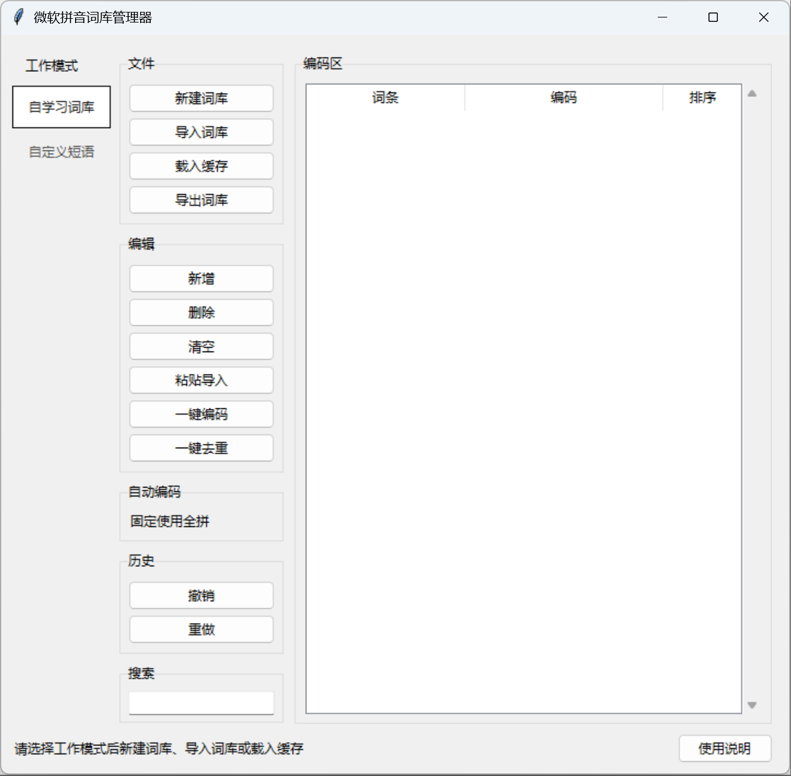

# 微软拼音词库管理器

一个用于管理微软拼音两类 DAT 词库的 Windows 桌面工具：

- `ChsPinyinUDL.dat`：自学习词库
- `UserDefinedPhrase.dat`：自定义短语词库

它将两类词库分开管理，支持导入、编辑、搜索、自动生成拼音编码、去重、本地缓存和安全导出新的 DAT 文件。

> 本项目与 Microsoft 无隶属、赞助或认可关系。
>
> English README: [docs/README.en.md](docs/README.en.md)



## 下载与使用

普通 Windows 用户请在 [Releases](https://github.com/Iemooon/mspy-dat-mgr/releases) 页面下载 ZIP 绿色版，完整解压后双击 `mspy-dat-mgr.exe` 即可运行，无需安装 Python。

程序启动时会自动展示中文“使用说明”；主界面右下角也保留“使用说明”按钮，便于随时查看。

基本流程：

1. 在左侧选择“自学习词库”或“自定义短语”。
2. 点击“新建词库”建立空词库，或点击“导入词库”读取已有 DAT 文件。
3. 可新增、双击编辑、粘贴导入、一键编码、一键去重和撤销/重做；编辑内容会自动保存为本地缓存。
4. 点击“导出词库”生成新的 DAT 文件，再由你自行导入微软拼音并核验结果。

## 主要功能

- 自学习词库与自定义短语词库分栏独立管理
- 新建词库、导入 DAT、载入本地缓存、导出新 DAT
- 新增、删除、清空、搜索、批量粘贴导入、去重、撤销与重做
- 在词条表格内按 `Delete` 可快速删除选中词条；可按 `Ctrl+Z` 撤销
- 双击编辑词条、编码和自定义短语排序值
- 自动生成全拼编码；自定义短语还可选择首字母编码
- 自学习词库自动兼容微软拼音 DAT 的 `v`/`u` 音节写法（如 `lve` 自动规范为 `lue`）
- 导出后自动重新读取校验
- 不允许覆盖导入的原 DAT 文件

## 安全边界

- 导入的 DAT 文件只读，程序不会修改原文件。
- 程序不会写入 Windows 输入法目录。
- 程序不会自动执行微软拼音词库导入。
- 只有用户主动点击“导出词库”时，才会生成新的 DAT 文件。
- 本地缓存和导出的 DAT 文件可能包含个人词条，默认不提交到 Git。

## 兼容性与注意事项

两类 DAT 的标准生成路径均已在开发者 Windows 环境中完成微软拼音实机导入验证。不同 Windows 或微软拼音版本仍可能存在差异。

导入任何导出文件前，请先在微软拼音设置中备份原有词库，并先用少量测试词条验证。使用本工具产生的文件，需由使用者自行确认导入结果。

## 源码运行

运行环境：

- Windows 10 或 Windows 11
- Python 3.10 及以上（含 Tkinter）

```cmd
git clone https://github.com/Iemooon/mspy-dat-mgr.git
cd mspy-dat-mgr
python -m pip install -r requirements.txt
python main.py
```

## 测试

仓库只包含人工构造、不含个人信息的回归测试夹具；不包含真实导入词库、导出 DAT 或本地缓存。

```cmd
python run_regression.py
python -m gui.app --smoke-test
```

## 本地打包（可选）

```cmd
python -m venv .release-venv
.release-venv\Scripts\python -m pip install -r requirements.txt pyinstaller
.release-venv\Scripts\python -m PyInstaller --noconfirm --clean --windowed --name "mspy-dat-mgr" --paths . main.py
copy README.txt dist\mspy-dat-mgr\README.txt
```

也可以直接运行 `build_release.cmd`，生成绿色版 ZIP。打包文件将生成在 `dist/`，默认不会提交到 Git。

## 许可证

[MIT License](LICENSE)
